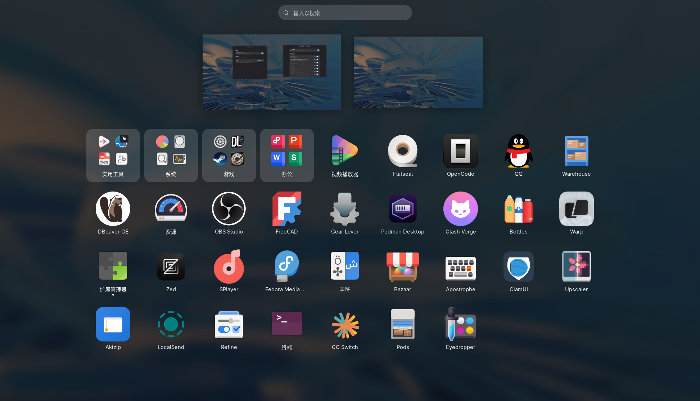
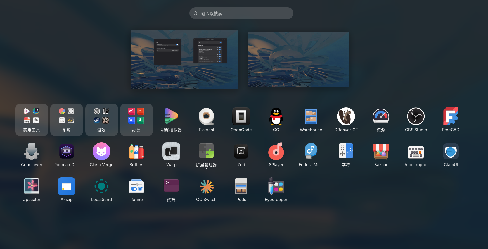
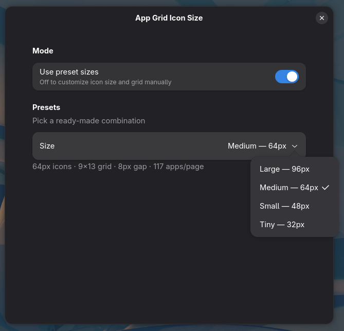
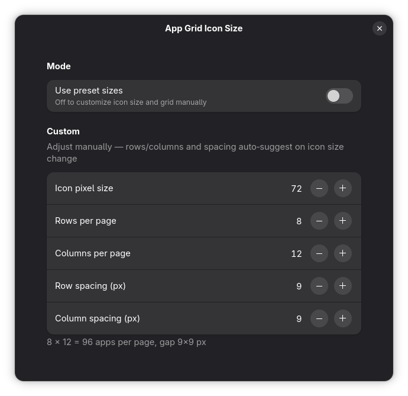

# AppGrid Fit

A GNOME Shell 50 extension that lets you customize the App Grid layout — icon size, rows/columns per page, and spacing — so you can fit more apps on each page.

## Features

- **4 preset levels**: Large (96px), Medium (64px), Small (48px), Tiny (32px)
- **Auto-fit**: Presets automatically calculate optimal rows/columns for your screen
- **Custom mode**: Fine-tune icon size, rows, columns, row/column spacing independently
- **Page consolidation**: Automatically fills pages to capacity, reducing empty pages
- **Live reload**: Changes apply instantly, no shell restart needed (except first install)

## Screenshots

**App Grid — Large Icons**



**App Grid — Medium**



**Preferences — Preset Mode**



**Preferences — Custom Mode**



## Presets

| Level | Icon Size | Grid | Apps/Page | Gap |
|-------|-----------|------|-----------|-----|
| Large | 96 px | 4×6 | 24 | 24 px |
| Medium | 64 px | 6×9 | 54 | 18 px |
| Small | 48 px | 8×12 | 96 | 14 px |
| Tiny | 32 px | 12×16 | 192 | 10 px |

## Installation

```bash
# Compile schema
glib-compile-schemas schemas/

# Package
gnome-extensions pack --force "$(pwd)"

# Install
gnome-extensions install --force appgrid-size@luyao.shell-extension.zip

# Reload GNOME Shell (required for first install)
# Press Alt+F2, type "r", press Enter
# Or log out and log back in

# Enable
gnome-extensions enable appgrid-size@luyao
```

## Usage

Open the extension preferences via:

- **Extensions** app → AppGrid Fit → Settings
- Or run: `gnome-extensions prefs appgrid-size@luyao`

Switch between presets or enable **Custom Mode** for granular control.

## Requirements

- GNOME Shell 50

## License

MIT
