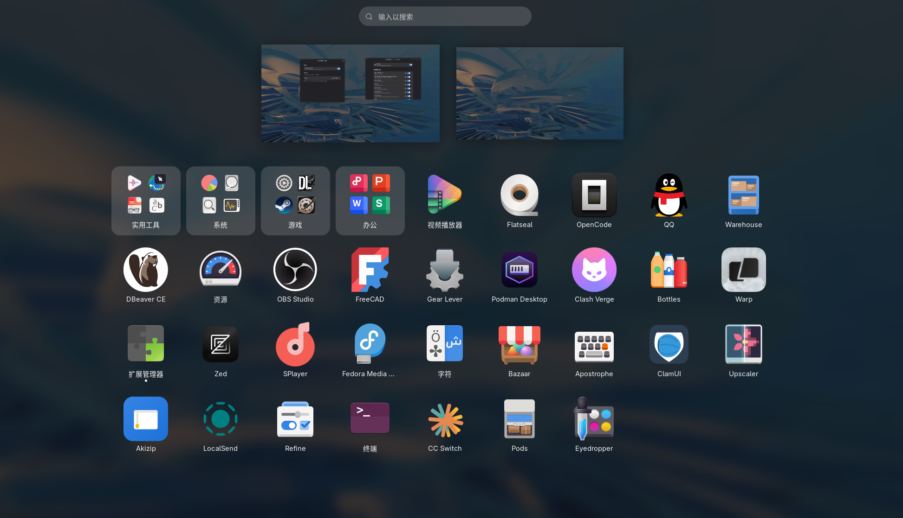
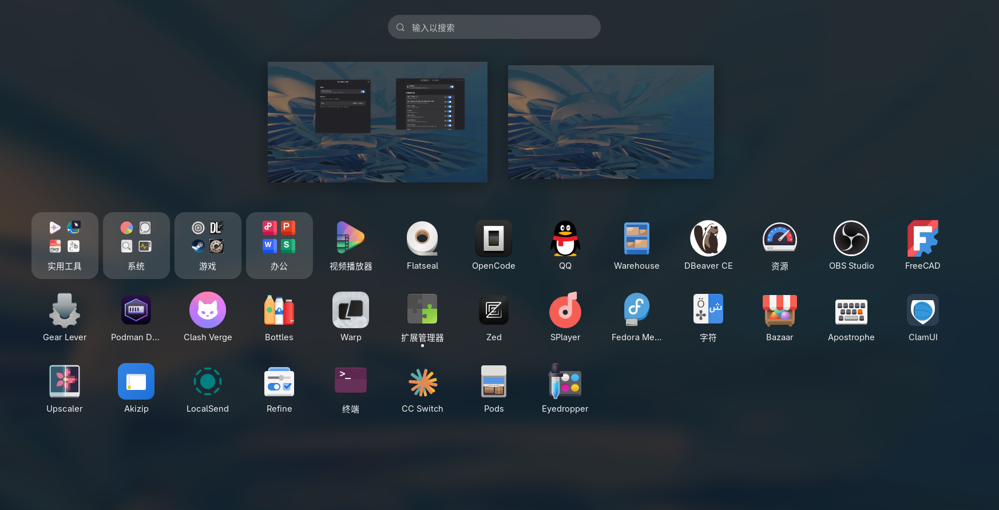
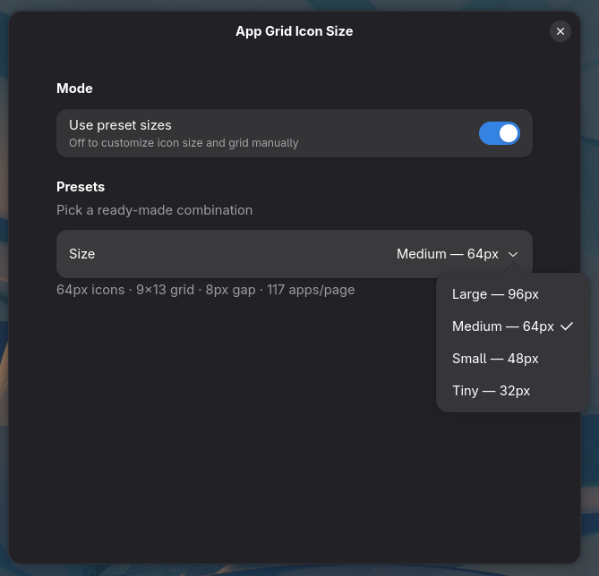
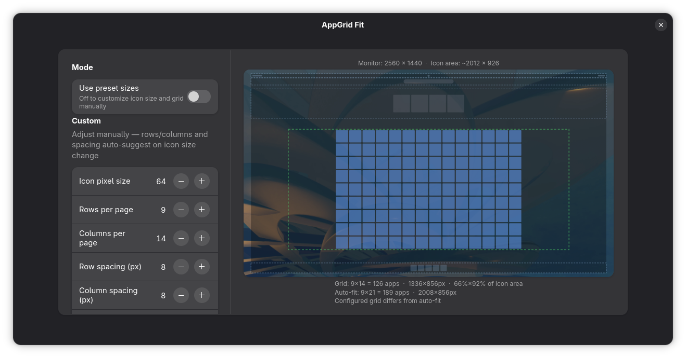

# AppGrid Fit

A GNOME Shell extension (46–50) that lets you customize the App Grid layout — icon size, rows/columns per page, and spacing — so you can fit more apps on each page.

Current version: **1.2.0**

## Features

- **4 preset levels**: Large (96px), Medium (64px), Small (48px), Tiny (32px)
- **Balanced fit**: Presets calculate rows/columns from your screen while using two thirds of the available width for a centered layout
- **Custom mode**: Fine-tune icon size, rows, columns, row/column spacing independently
- **Optional page consolidation**: Fills pages to capacity and saves the resulting app order only when explicitly enabled
- **Responsive layout**: Recalculates preset capacity when the overview allocation or monitor configuration changes
- **Live settings**: Preference changes apply immediately after the extension has been loaded

## Screenshots

**App Grid — Large Icons**



**App Grid — Medium**



**Preferences — Preset Mode**



**Preferences — Custom Mode**



## Presets

Presets use balanced fitting — the rows/columns below are base recommendations, while the actual grid is calculated from the current allocation at runtime. Balanced fitting intentionally uses two thirds of the available icon-area width so the grid remains compact and centered.

| Level | Icon Size | Base Grid | Gap |
|-------|-----------|-----------|-----|
| Large | 96 px | 4×6 | 24 px |
| Medium | 64 px | 6×9 | 18 px |
| Small | 48 px | 8×12 | 14 px |
| Tiny | 32 px | 12×16 | 10 px |

## Installation

```bash
# Compile schema
glib-compile-schemas schemas/

# Package
gnome-extensions pack --force \
  --extra-source=config.js \
  --extra-source=gridPages.js \
  --extra-source=LICENSE \
  "$(pwd)"

# Install
gnome-extensions install --force appgrid-size@luyao.shell-extension.zip

# Reload GNOME Shell (required for first install or schema changes)
# Xorg: press Alt+F2, type "r", press Enter
# Wayland: log out and log back in

# Enable
gnome-extensions enable appgrid-size@luyao
```

## Usage

Open the extension preferences via:

- **Extensions** app → AppGrid Fit → Settings
- Or run: `gnome-extensions prefs appgrid-size@luyao`

Switch between presets or disable **Use preset sizes** for granular control. Custom values are independent: changing the icon size does not overwrite the configured rows, columns, or spacing.

**Consolidate app pages** is disabled by default. Enabling it fills earlier pages and permanently saves the resulting application order.

The preferences window uses a horizontal layout with controls on the left and a large monitor preview on the right. While the extension is active, the preview uses measured App Grid tiles, icons, per-page item counts, search entry, workspace thumbnails, and Dash geometry from GNOME Shell instead of relying solely on a generic monitor estimate. Before live geometry is available, it reads Shell's top-level app-picker layout so folders and page boundaries still produce the correct visible icon count. Open the overview once after changing the layout to publish settled positions. Its default size is 1200×560.

## Requirements

- GNOME Shell 46, 47, 48, 49, or 50

## License

MIT

## Changelog

See [CHANGELOG.md](CHANGELOG.md) for release details.

## Development checks

```bash
npm run check:js
npm test
glib-compile-schemas --strict --dry-run schemas/
```
